# yin:bit
micro:bit用の拡張モジュールです。micro:bitでフルカラーLED(WS2812B)をコントロールできます。

## 特長
従来からmicro:bitでフルカラーLEDを点灯させるモジュール等はありましたが、  micro:bitから出力される3.3VをフルカラーLEDの電源として使っているものや、電源を単3電池×3本を前提にしている物が多く、安定して光らせられるLEDの数は多くはありませんでした。

本モジュールは、本モジュールについているUSBコネクタから電源供給することで、  micro:bitに給電しつつフルカラーLEDを5V給電することが可能で、micro:bitからフルカラーLEDに給電する際より多くの数のLEDを安定して光らせることができます。

フルカラーLEDの点灯を一時的に抑えたいとき等のために、フルカラーLEDの電源ON/OFFスイッチも実装してあります。

Groveコネクタも実装してありますので、センサの値に応じて好きな色に光らせるといったこともできます。

## Ver2.0の特徴
光らせたいけどはんだ付けは敷居が高い…という声があり、フルカラーLED部分がGrove互換コネクタが付き、はんだ付け無しでyin:bitを扱えるようになりました。

下記のようなGrove互換コネクタ付きフルカラーLEDを使えます。
 - [Grove - RGB LED (WS2813 Mini)](https://www.seeedstudio.com/Grove-RGB-LED-WS2813-Mini-p-4269.html)
 - [Grove - RGB LED Ring (24-WS2813 Mini)](https://www.seeedstudio.com/Grove-RGB-LED-Ring-24-WS2813-Mini-p-4202.html)
 - [Grove - RGB LED Stick (20-WS2813 Mini)](https://www.seeedstudio.com/Grove-RGB-LED-Stick-20-WS2813-Mini-p-4271.html)
 - [HEX RGB LED Board (SK6812)](https://m5stack.com/products/hex-rgb-led-board-sk6812)
 - [SK6812 RGB LED Flex-strip](https://m5stack.com/collections/m5-unit/products/sk6812-rgb-led-flex-strip)

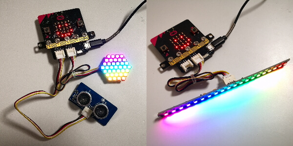

またいろんなものに組み込むための固定用ネジ穴が追加されました。固定用ネジ穴部を分離するとyin:bitと同サイズになります。

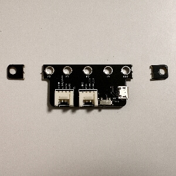

## 使い方

1. yin:bitをmicro:bitにネジで固定します。

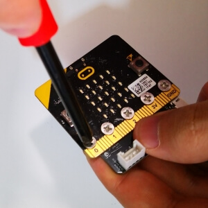

2. micro:bitにUSBケーブルを接続します。(プログラムをアプリから無線で書き込む際は不要)

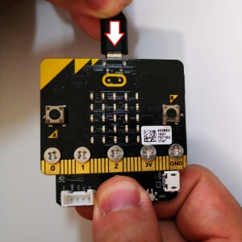

3. micro:bitにプログラムを書き込みます。(プログラムの例は[サンプル](#サンプル)参照)

4. yin:bitにUSBケーブルを差し込み電源と接続します。

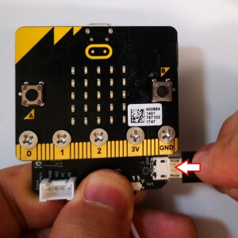

5. yin:bitのLED電源スイッチをONします。

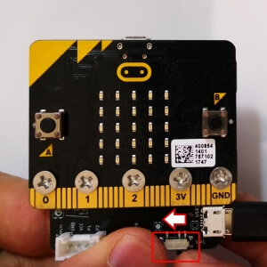

## スペック
 - サイズ(v1) : 50.8 × 22.0 × 6.5mm  
 - サイズ(v2) : 68.8 × 24.8 × 8.0mm
 - フルカラーLED用電源電圧(v2だとフルカラーLED用Grove互換コネクタ電源電圧) : 5V
 - フルカラーLED用電源最大電流値 : 2A
 - 入出力用Grove互換コネクタ電源電圧：3.3 V

## ピン
 - フルカラーLEDシリアルピン(v2だとフルカラーLED用Grove互換コネクタ) : P0 
 - 入出力用Grove互換コネクタ : P1/P2

## どこで買える？
 - [スイッチサイエンス](https://www.switch-science.com/catalog/5431/)
 - [スイッチサイエンス(コネクタ実装版)](https://www.switch-science.com/catalog/5821/)
 - [マルツオンライン](https://www.marutsu.co.jp/pc/i/1559574/)
 - [シリコンハウス共立](http://blog.siliconhouse.jp/archives/52170700.html)
 - [Shigezone](https://twitter.com/ShigezoneAkiba/status/1170178701419405312)
 
## サンプル

20個のLEDをついたフルカラーLEDテープを使うことを想定します。

micro:bitでフルカラーLEDを使う場合は「拡張機能」の「NeoPixel」をプロジェクトに追加してください。

### LEDを全て赤色に光らせる

[プログラム例](https://makecode.microbit.org/_FkpHuT0tiH0w)

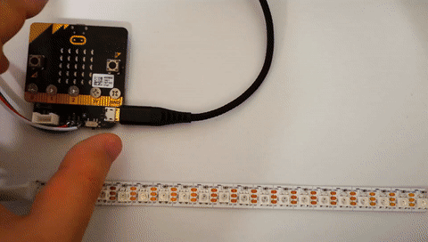

### LEDを虹色に光らせて流す

[プログラム例](https://makecode.microbit.org/_2kAJboFzL6Ek)

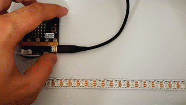

### [Groveのジョイスティック](http://wiki.seeedstudio.com/Grove-Thumb_Joystick/)を使って操作する

[プログラム例](https://makecode.microbit.org/_hW461R9WmUEq)

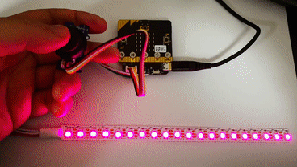

### 無線を使って遠隔で電飾を操作する

[プログラム例](https://makecode.microbit.org/_WzrJAp9o9Hsq)

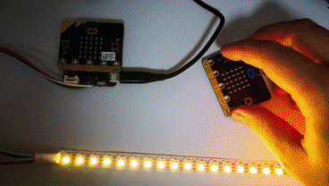

### [Groveの超音波距離センサ](http://wiki.seeedstudio.com/Grove-Ultrasonic_Ranger/)を使って操作する

[プログラム例](https://makecode.microbit.org/_3hC7kxe1rCEK)

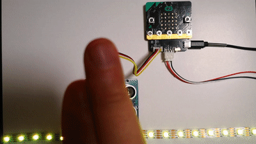

### おまけ:サーボモーターを動かす

サーボモーターにも使えます。サーボモーターのコードとyin:bitを下記のように繋いでください。

|サーボモーター|yin:bit|
|:-----------:|:------------:|
|茶色|GND|
|赤色|5V|
|黄色|LED_P0|

[プログラム例](https://makecode.microbit.org/_HUk0EjgW45yJ)

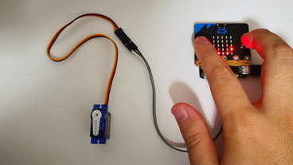

## 作品例

### [電飾エプロン](https://twitter.com/GomiHgy/status/1124863205099036674)(by[五味](https://twitter.com/GomiHgy))

### [micro:bitで光るスカート作ったで](https://www.nicovideo.jp/watch/sm35141886)(by[ましぐれ](https://twitter.com/mashigure))

### [サイバリアン電飾](https://twitter.com/i/moments/1194228358986383362)(by[RealizePlus](https://twitter.com/Realize_Plus))

### [光るウエディングドレスと連動する電飾キャンドルサービスを作ってみた](https://youtu.be/PWPQaGGIQgU)(by[静丘](https://twitter.com/Siz_oka))

## 終わりに

yin:bitの改良点がありましたら、ぜひIsuuesに書いてください。
こんな作品作ったよ！という方は [#yinbit](https://twitter.com/search?q=%23yinbit&src=typed_query) を付けてSNSなどで公開してくださると嬉しいです。
よい電飾ライフを！
