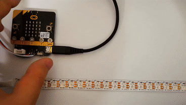

# yin:bit
micro:bit用の拡張モジュールです。micro:bitでフルカラーLED(WS2812B)をコントロールできます。

## 特長
従来からmicro:bitでフルカラーLEDを点灯させるモジュール等はありましたが、  micro:bitから出力される3.3VをフルカラーLEDの電源として使っているものや、電源を単3電池×3本を前提にしている物が多く、安定して光らせられるLEDの数は多くはありませんでした。

本モジュールは、本モジュールについているUSBコネクタから電源供給することで、  micro:bitに給電しつつフルカラーLEDを5V給電することが可能で、micro:bitからフルカラーLEDに給電する際より多くの数のLEDを安定して光らせることができます。

フルカラーLEDの点灯を一時的に抑えたいとき等のために、フルカラーLEDの電源ON/OFFスイッチも実装してあります。

Groveコネクタも実装してありますので、センサの値に応じて好きな色に光らせるといったこともできます。

## 使い方

1. yin:bitをmicro:bitにネジで固定します。

2. micro:bitにUSBケーブルを接続します。(プログラムをアプリから無線で書き込む際は不要)

3. micro:bitにプログラムを書き込みます。(プログラムの例は[サンプル](#サンプル)参照)

4. yin:bitにUSBケーブルを差し込み電源と接続します。

5. yin:bitのLED電源スイッチをONします。

## スペック

サイズ : 50.8 × 22.0 × 6.5mm   
Grove電源供給ピン電圧 : 3.3V  
フルカラーLED用電源電圧 : 5V  
フルカラーLED用電源最大電流値 : 2A

## ピン

フルカラーLEDシリアルピン : P0  
Grove用入出力ピン : P1/P2

## サンプル

20個のLEDをついたフルカラーLEDテープを使うことを想定します。

micro:bitでフルカラーLEDを使う場合は「拡張機能」の「NeoPixel」をプロジェクトに追加してください。

### LEDを全て赤色に光らせる

[プログラム例](https://makecode.microbit.org/_FkpHuT0tiH0w)

### LEDを虹色に光らせて流す

[プログラム例](https://makecode.microbit.org/_2kAJboFzL6Ek)

### Groveのスイッチを使って操作する

[プログラム例](https://makecode.microbit.org/_hW461R9WmUEq)

### 無線を使って遠隔で電飾を操作する

[プログラム例](https://makecode.microbit.org/_WzrJAp9o9Hsq)

### おまけ:サーボモーターを動かす

サーボモーターにも使えます。サーボモーターのコードとyin:bitを下記のように繋いでください。

|サーボモーター|yin:bit|
|:-----------:|:------------:|
|茶色|GND|
|赤色|5V|
|黄色|LED_P0|

[プログラム例](https://makecode.microbit.org/_HUk0EjgW45yJ)

## 作品例

### [電飾エプロン](https://twitter.com/GomiHgy/status/1124863205099036674)(by[五味](https://twitter.com/GomiHgy))

### [micro:bitで光るスカート作ったで](https://www.nicovideo.jp/watch/sm35141886)(by[ましぐれ](https://twitter.com/mashigure))

### [サイバリアン電飾](https://twitter.com/i/moments/1194228358986383362)(by[RealizePlus](https://twitter.com/Realize_Plus))

## 終わりに

yin:bitの改良点がありましたら、ぜひIsuuesに書いてください。

こんな作品作ったよ！という方は #yinbit を付けてSNSなどで公開してくださると嬉しいです。

よい電飾ライフを！
